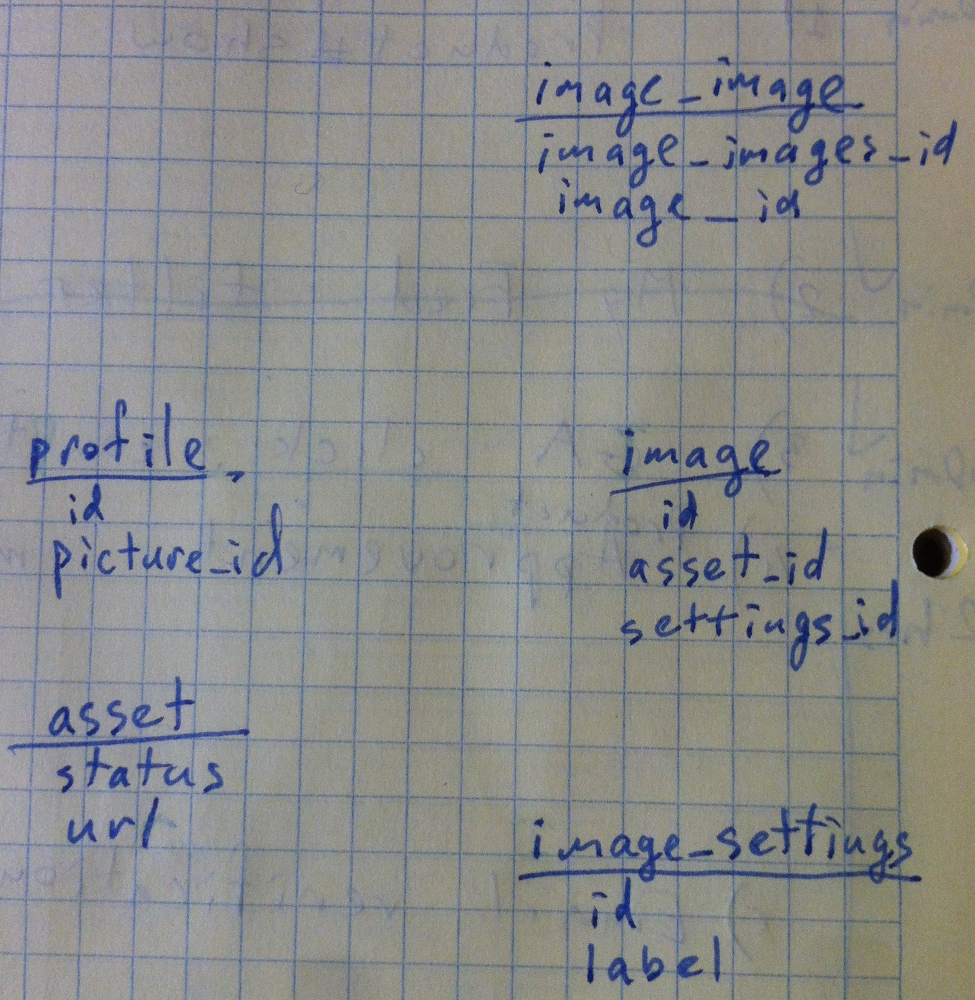
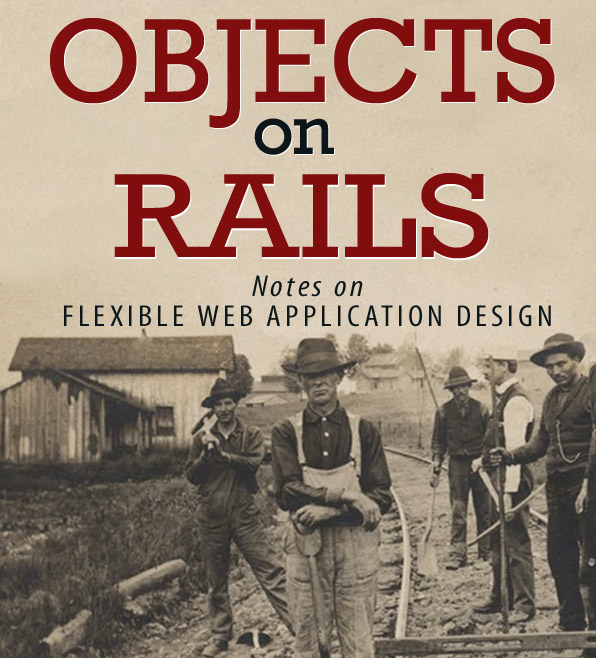

# История про штангиста


Или тернистый и увлекательный путь от Rails-way к модульной архитектуре

---

## Проект

* Приложение на Grails
* База данных 70 таблиц

## База

* Все нормализовано
* Названия не соответствуют рельсовым соглашениям
* Кое-где логика дублируется
* Целостность очень важна

---

# Так хранятся картинки, например



API должно вернуть следующее:

```javascript

  ...,
  image:
  {
    state: 'approved',
    variants: {
	   'profile': 'http://url...',
	   'thumbnail': 'http://url...'
    }
  },
  ...

```

---

# Чего хочет заказчик:

* JSON API на рельсе
* Фронтенд на ангуляре (есть отдельная команда).
* Со временем слезть с Grails совсем.

---

# Первый подход к снаряду


* rails-api
* active-record
* rabl
* rspec

---

# RABL

```ruby
# app/views/users/show.rabl
object @user

# Declare the properties to include
attributes :first_name, :last_name

# Alias 'age' to 'years_old'
attributes :age => :years_old

# Include a custom node with full_name for user
node :full_name do |user|
  [user.first_name, user.last_name].join(" ")
end

# Include a custom node related to if the user can drink
node :can_drink do |user|
  user.age >= 21
end
```

---
# RABL


```javascript
// rails c
// User.create(...)
// rails s -p 3001
// http://localhost:3001/users/1.json
{
  user: {
    first_name: "Bob",
    last_name: "Hope",
    years_old: "92",
    full_name: "Bob Hope",
    can_drink: true
  }
}
```

---

# Поехали


---

# Роуты

```ruby
resources :users, only: [] do
  member do
    get 'online'
  end
end

post '/contactform', to: 'contact_forms#create'

post '/bonuscode', to: 'bonuscodes#create'
put  '/bonuscode', to: 'bonuscodes#redeem'
get  '/bonuscode/:code', to: 'bonuscodes#status', code: /[A-Za-z\d]+/
```

---
# Модели

```ruby
class ImageSettings < ActiveRecord::Base
  self.table_name = 'image_settings'
end

class Asset < ActiveRecord::Base
  self.table_name = 'asset'
  belongs_to :image
end

```

---

# Модели
```ruby
class Image < ActiveRecord::Base
  self.table_name = 'image'
  has_and_belongs_to_many :image_variants,
    join_table: "image_image",
    class_name: "Image",
    association_foreign_key: :image_images_id
  belongs_to :settings,
             foreign_key: :settings_id,
             class_name: 'ImageSettings'
  belongs_to :asset
end
```
---

# Проблемки

* Поля типа *BIT* в таблицах: *approved: "\x00"*
* констрэйнты в базе прописаны, а defaults - нет
* например непонятная колонка *version*
* в некоторых таблицах колонки называются *class* и *hash*
* по факту в таблице user хранятся разные типы юзеров с разным поведением

---

## Ну мы же умные теперь.

### А давайте...




* отделим логику от хранения
* приткнем куда-нибудь PORO!
* и припилим отдельные валидаторы, чтобы разных юзеров сохранять без проблем
* и вообще дадим поменьше прав AR-объектам

---

# Решеньица

```ruby
  def to_boolean(bitfield_value)
    bitfield_value.getbyte(0) == 1
  end

  def online
    to_boolean(is_online)
  end
```

---
# Решеньица

* version - это ж optimistic locking

```ruby
self.locking_column = :version
```

---

# Решеньица


```ruby
 gem "default_value_for"
 gem 'safe_attributes'
 gem 'fig_leaf'
 gem 'virtus'
 gem 'themis'

 ...
 gem 'boolean_bitfields'
```

---

# Решеньица

```ruby
class AssetData < DataModel
  self.table_name = 'asset'
  boolean_bitfield :approved
end
```

---

# Решеньица

```ruby
class DataModel < ActiveRecord::Base
  self.abstract_class = true

  include FigLeaf
  hide ActiveRecord::Base, ancestors: true,
       except: [ Object, :init_with, :new_record?,
                 :errors, :valid?, :save ]
  hide_singletons ActiveRecord::Calculations,
                  ActiveRecord::FinderMethods,
                  ActiveRecord::Relation

  self.locking_column = :version
  default_value_for :version, 0
end
```

---

# Модели
```ruby
class User < DataModel
  self.table_name = 'user'

  validates_uniqueness_of :email, allow_nil: true
  validates_uniqueness_of :username, allow_nil: true

  has_validation :operator, OperatorValidation
  has_validation :enduser, EndUserValidation
  ...
end
```
---

# Валидаторы
```ruby

module OperatorValidation
  extend Themis::Validation
  validates_presence_of :username, :password, :email, :surname,
                        :forename,:street, :streetnumber
  validates :password, length: { minimum: 8 }
  validates :email, email: true
end

module EndUserValidation
  extend Themis::Validation

  validates_presence_of :username, :password, :email
  validates :password, length: { minimum: 6 }
  validates :email, email: true
end

```

---


# Контроллеры

```ruby
class API::V1::SubscribersController < ApplicationController
  before_action :get_subscriber, :validate_subscriber, only: :create

  def create
    @subscriber.save
    deliver 201, @subscriber
  end

  private
  def get_subscriber; @subscriber = Subscriber.new(subscriber_params) end
  def validate_subscriber; validate(@subscriber) end
  def subscriber_params; params.permit(:email) end
end
```

---
# Контроллеры

```ruby
class API::V1::BonuscodesController < ApplicationController
  def redeem
    use_case = RedeemBonuscode.new(params[:code], params[:receptor_id])

    begin
      recipient_balance = use_case.run!
    rescue RedeemBonuscode::BonuscodeNotFound
      deliver 404, {error: RedeemBonuscode::Messages.new(:bonuscode_not_found)} and return
    rescue RedeemBonuscode::BonuscodeIsAlreadyUsed
      deliver 404, {error: RedeemBonuscode::Messages.new(:used_bonuscode)} and return
    rescue RedeemBonuscode::RecipientNotFound
      deliver 404, {error: RedeemBonuscode::Messages.new(:recipient_not_found)} and return
    rescue RedeemBonuscode::IncorrectRecipientType
      deliver 403, {error: RedeemBonuscode::Messages.new(:not_enduser)} and return
    end

    deliver 201, {balance: (recipient_balance*100).to_i}
  end
```


---
# Юз-кейсы

```ruby
class RedeemBonuscode
  def initialize(hashcode, recipient_id)
    @hashcode, @recipient_id = hashcode, recipient_id
  end

  def run!
    fail BonuscodeNotFound.new unless bonuscode = Bonuscode.find_by_hash(@hashcode)
    fail BonuscodeIsAlreadyUsed.new if bonuscode.used?
    fail RecipientNotFound.new unless recipient = User.find_by_id(@recipient_id)
    fail IncorrectRecipientType.new unless correct_user_type?(recipient.type)

    ActiveRecord::Base.transaction do
      amount = bonuscode.redeem!(@recipient_id)
      recipient.increase_balance!(amount)

      recipient.save! && bonuscode.save!
      recipient.balance
    end
  end

  private
  def correct_user_type?(user_type)
    ['regular', 'paying'].include?(user_type)
  end
end
```


---
# Все было бы почти классно, если бы не ...

---

# Тесты

* По schema.rb не генерится тестовая база данных
* мне показалось это хорошим поводом прокачать изолированное тестирование
* да, для этого уже был гем: *'activerecord-nulldb-adapter'*


---
# Приемочные тесты

```ruby
include NullDB::RSpec::NullifiedDatabase

describe '/api/v1/register/newsletter' do

  context 'with correct attributes' do
    it 'responds with created user id' do
      stub(Configuration).forbidden_domains { ["mailinator.com"] }
      post '/api/v1/register/newsletter', email: 'a23423@gmail.com'

      expect(json).not_to have_key('errors')
      expect(json).to have_key('id')
      expect(json).not_to have_key('password')

      expect(response).to be_success

      ## → We can not test uniqueness with NullDB adapter ←
      # post '/api/v1/register/newsletter', email: 'a23423@gmail.com'
    end
  end
```

---

# Типа юнит тесты

```ruby
describe RedeemBonuscode do
  let (:valid_code) { OpenStruct.new(hash_value: 'validcode', amount: 1.00) }
  let (:enduser) { OpenStruct.new(id: 123, type: 'paying', balance: 2.00) }
  let (:final_balance) { 3.00 }

  it 'returns updated user balance' do
    stub(Bonuscode = Object.new).find_by_hash(valid_code.hash_value) { valid_code }
    stub(User = Object.new).find_by_id(enduser.id) { enduser }
    stub(valid_code).used? { false }
    stub(valid_code).redeem(enduser.id) { valid_code.amount }
    stub(enduser).increase_balance(valid_code.amount) { final_balance }

    use_case = RedeemBonuscode.new(valid_code.hash_value, enduser.id)
    expect(use_case.run!).to eq(final_balance)
  end
```

И так еще пять раз для каждого сценария

---

# По факту получилось не так уж плохо:

* Валидации выехали из моделей
* Основная бизнес-логика заехала в юзкейсы
* Юзкейсы могут вызывать другие юзкейсы!
* Контроллеры занимаются тем чем и должны


---

# Неплохо, но:

* Бардак в базе провоцирует бардак в AR-моделях
* Роуты - абсолютно бесполезная прослойка
* Какая-то фигня с тестированием

---

# А как же репозитории?


---

# Второй подход к снаряду


* sinatra
* virtus
* active-record ????

---

# Удача


### Заказчику нужен небольшой сервис вообще не про базу!

```bash
mkdir sinatra-app
cd sinatra-app
git init .

```

---
# Sinatra - 70 строк кода

```ruby
class SenderSerice < Sinatra::Base
  get '/sms/create/:message/:number' do
    input = MessageInput.new(params)
    sender = TwilioMessageSender.new('xxxxxx', 'xxxxxx', '+15005550006')
    use_case = SendSms.new(input, sender)

    begin
      use_case.run!
    rescue ValidationError => ex
      status 403
      return 'invalid input'
    rescue SendingError => ex
      status 500
      return 'failed to send message'
    end
    status 201
    "Hello world, it's #{Time.now} at the server!"
  end
end
```

---

# Инпут

```ruby
class BonuscodeRedeemInput < Input
  attribute :hash_code, String
  attribute :receptor_id, Integer

  validates_presence_of :hash_code, :receptor_id
  validates_numericality_of :receptor_id

end
```

---

# Подключаем в рельсу

```ruby
mount SenderService, :at => '/internal_api'
```

---

## Невероятный успех!

### Пишем следующий кусок API на синатре!

---

# С ActiveRecord репозитории делать больно


---

# Sequel FTW!


---

# Репозитории

```ruby
def find(id)
  to_remove = [:gender_id, :vk, :online_profile_status_id, :picture_id, :picture_to_approve_id]
  to_add = [:gender__name___gender,
  :vk___description, :online_profile_status__name___status,
  :online_profile_status__is_online___is_online, :picture_id___image_id]

  dataset = table.join(:online_profile_status, id: :online_profile_status_id)
                 .join(:gender, id: :profile__gender_id)
                 .se lect_all(:profile)
                 .select_append(*to_add)
                 .where(profile__id: id)

  all = dataset.all.map do |record|
    attrs = record.delete_if{|d| to_remove.include? d}
    Profile.new(attrs)
  end

  all.size > 1 ? all : all.first
end
```
---

# Репозитории

```ruby
def persist(profile)
      status_id = DB[:online_profile_status].select(:id).where(name: profile.status).get(:id)
      raise UnknownProperty.new(:status) unless status_id

      gender_id = DB[:gender].select(:id).where(name: profile.gender).get(:id)
      raise UnknownProperty.new(:gender) unless gender_id

      hash = { username: profile.username, vk: profile.description,
               age: profile.age, user_id: profile.user_id,
               deleted: profile.deleted, online_profile_status_id: status_id, gender_id: gender_id,
               picture_id: profile.image_id
             }

      if profile.new_record?
        dates = { date_created: Time.now.utc,
                  last_updated: Time.now.utc }
        profile.id = table.insert(hash.merge! dates)
      else
        table.where(id: profile.id).update(hash)
      end
    end
```
---

```ruby
class Profile < Entity
  attribute :id, Integer
  attribute :user_id, Integer
  attribute :username, String
  attribute :age, Integer
  attribute :description, String
  attribute :deleted, Bitfield, default: false
  attribute :is_online, Bitfield, default: false

  attribute :gender, String
  attribute :status, String, default: 'alwaysOffline'

  attribute :image_id, Integer
  attribute :image, 'Image'
  # attribute :visibility,

  def online_desire
    ...
  end
end
```

---

# Good

* получилось сделать слой репозиториев
* весь трэш текущей структуры данных остался в этом же слое
* инпуты вместо разных валиадций в моделях
* true PORO
* избавились от рельсового оверхэда


---

# Not so good

* не получилось сделать отдельный адаптер для in-memory хранения данных
* тестировать стало совсем скучно :)
* потеряли немного рельсовой инфраструктуры
*